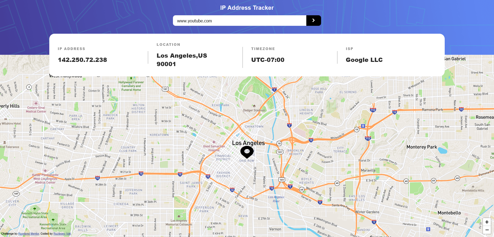

# Frontend Mentor - IP address tracker solution

This is a solution to the [IP address tracker challenge on Frontend Mentor](https://www.frontendmentor.io/challenges/ip-address-tracker-I8-0yYAH0). Frontend Mentor challenges help you improve your coding skills by building realistic projects. 

## Overview

### The challenge

Users should be able to:

- View the optimal layout for each page depending on their device's screen size ✔️
- See hover states for all interactive elements on the page ✔️
- See their own IP address on the map on the initial page load ✔️
- Search for any IP addresses or domains and see the key information and location ✔️

### Screenshot

### Links

- Live Site URL: [Live site URL here](https://wth-is-my-ip.netlify.app)

### Built with

- HTML5 
- CSS
- Flexbox
- CSS Grid

## Author
### Ezra Adeyinka

- Frontend Mentor - [@Ezra Adeyinka](https://www.frontendmentor.io/profile/adeyinkaezra123)
- Linkedin - [Ezra Adeyinka](https://www.linkedin.com/in/ezra-adeyinka/)
